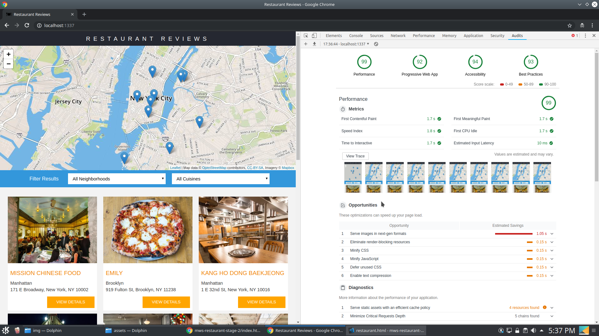
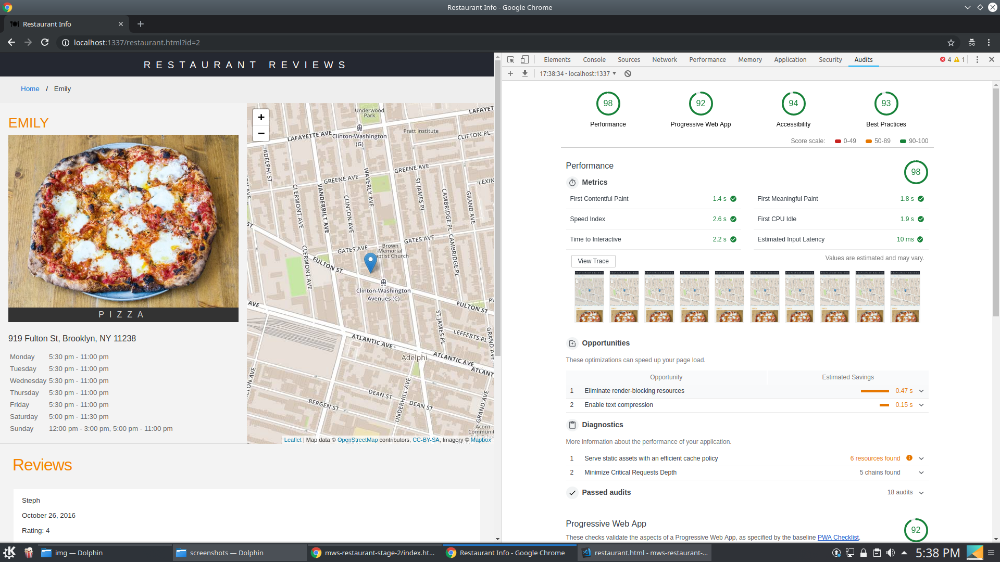

# Running the project

```bash
npm install
npm start
```

Server will start at port `http://localhost:1337/`

## Chrome Audit Results

| Criteria            | Index Page | Restaurant-info Page |
| ------------------- | ---------- | -------------------- |
| Performance         | 99         | 99                   |
| Progressive web App | 92         | 92                   |
| Accessibility       | 94         | 94                   |
| Best Practises      | 93         | 93                   |

### Index Page Audit ScreenShot



### Restaurant Info Audit Screenshot



## Project structuring

All the client side code is present in assets file. When the server starts all files from `assests` is moved to `.tmp\public` using gulp.

Sails hosts files under `.tmp\public`.

### Client side changes

Updated DB helper to read data from api instead of the json file.
